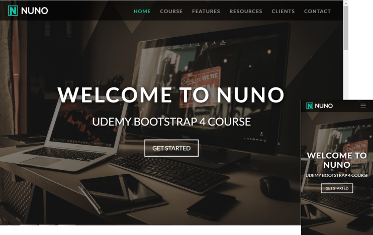

# Site responsivo com Bootstrap 4

Este projeto é um site responsivo construiddo inspirado em um template visto anteriormente.

## Tecnologias utilizadas

- HTML5
- CSS3 e Media Queries
- Jquery
- Boostrap 4

## Contribuição

Se quiser explorar o projeto basta seguir os passos abaixo, fique a vontade para abrir uma issue caso possua uma idéia ou uma crítica para melhorar este projeto.

Para isso instale o Git baixe o projeto para a sua máquina com o git clone e explore-o!

Clone o projeto na sua máquina digitando na sua linha de comando:
~~~shell
git clone https://github.com/DaniloLima122/site-responsivo-bootstrap.git
~~~

## Links

- [Instalando o Git](https://git-scm.com/book/pt-br/v2/)

## Licença

- MIT